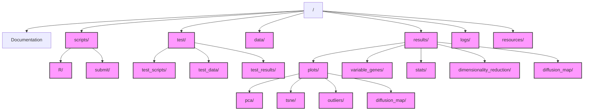

# Single-Cell Trajectory Analysis Pipeline

This repository contains R scripts and documentation for performing dimensionality reduction and trajectory analysis on single-cell RNA sequencing data using URD.

## Repository Structure



### Directory Overview

**scripts/**
- `R/` - Analysis scripts (numbered 01-05)
- `submit/` - O2 cluster submission scripts (numbered 01-05)

**test/**
- `test_scripts/` - Test implementation scripts
- `test_data/` - Test datasets
- `test_results/` - Test outputs

**results/**
- `plots/` - All visualization outputs
  - `pca/` - PCA analysis plots
  - `tsne/` - tSNE visualizations
  - `outliers/` - Outlier detection plots
  - `diffusion_map/` - Diffusion map visualizations
- `dimensionality_reduction/` - Dimensionality reduction results
  - Parameters and statistics
  - Outlier detection results
- `diffusion_map/` - Diffusion map analysis
  - Individual diffusion maps
  - Quality metrics and summaries
- `variable_genes/` - Variable genes analysis
- `stats/` - Statistical summaries

**data/** - Input data (not tracked)
**logs/** - Execution logs
**resources/** - Additional documentation

## Scripts

### Analysis Scripts (in `scripts/R/`)
1. `01_create_urd_object.R`: Creates a URD object
2. `02_find_variable_genes.R`: Identifies variable genes across stages
3. `03_run_dimensionality_reduction.R`: Performs PCA, tSNE, and clustering analyses
4. `04_run_diffusion_map.R`: Calculates diffusion map components
5. `05_run_pseudotime.R`: Computes pseudotime ordering

### Submission Scripts (in `scripts/submit/`)
1. `01_submit_urd_object.sh`: Submits URD object creation
2. `02_submit_var_genes.sh`: Submits variable genes analysis
3. `03_submit_dimred.sh`: Submits dimensionality reduction
4. `04_submit_diffmap.sh`: Submits diffusion map calculation
5. `05_submit_pseudotime.sh`: Submits pseudotime analysis

## Documentation

- `methodology_info.md`: Comprehensive documentation of the methodology, including:
  - Parameter selection rationale
  - Data-driven parameter adjustments
  - Visualizations of parameter relationships
  - Literature references

## Requirements

- R >= 4.2.2
- URD package
- Seurat package
- RColorBrewer package

## Usage

### Local Execution
Run the scripts in the following order:
```R
source("scripts/R/01_create_urd_object.R")
source("scripts/R/02_find_variable_genes.R")
source("scripts/R/03_run_dimensionality_reduction.R")
source("scripts/R/04_run_diffusion_map.R")
source("scripts/R/05_run_pseudotime.R")
```

### O2 Cluster Execution
Submit jobs in the following order:
```bash
cd scripts/submit
sbatch 01_submit_urd_object.sh
# Wait for completion, then:
sbatch 02_submit_var_genes.sh
# Wait for completion, then:
sbatch 03_submit_dimred.sh
# Wait for completion, then:
sbatch 04_submit_diffmap.sh
# Wait for completion, then:
sbatch 05_submit_pseudotime.sh
```

## Results

The analysis generates:
1. URD object creation
2. Variable genes analysis
   - Variable genes list
   - Stage-specific statistics
3. Dimensionality reduction
   - PCA plots and statistics
   - tSNE visualizations
   - Clustering results
4. Diffusion map analysis
   - Dataset: 28,567 cells across 17 stages
   - Parameters:
     - kNN: 71 (optimized for dataset size)
     - Sigma range: 12.0-45.6
     - Selected sigma: 45.6 (optimal quality)
   - Results:
     - 4 diffusion maps generated
     - Quality score: 0.004
5. Pseudotime analysis
   - Pseudotime ordering
   - Stage progression plots
   - Stability assessment

Results are saved in the `results/` directory with the following structure:
```
results/
├── plots/
│   ├── pca/
│   ├── tsne/
│   ├── outliers/
│   └── diffusion_map/
├── dimensionality_reduction/
├── diffusion_map/
├── variable_genes/
└── stats/
```

## References

See `methodology_info.md` for a comprehensive list of references and citations. 