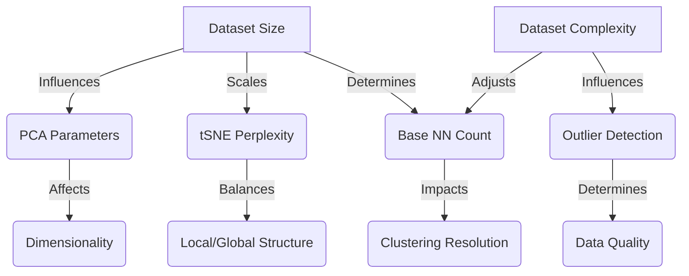
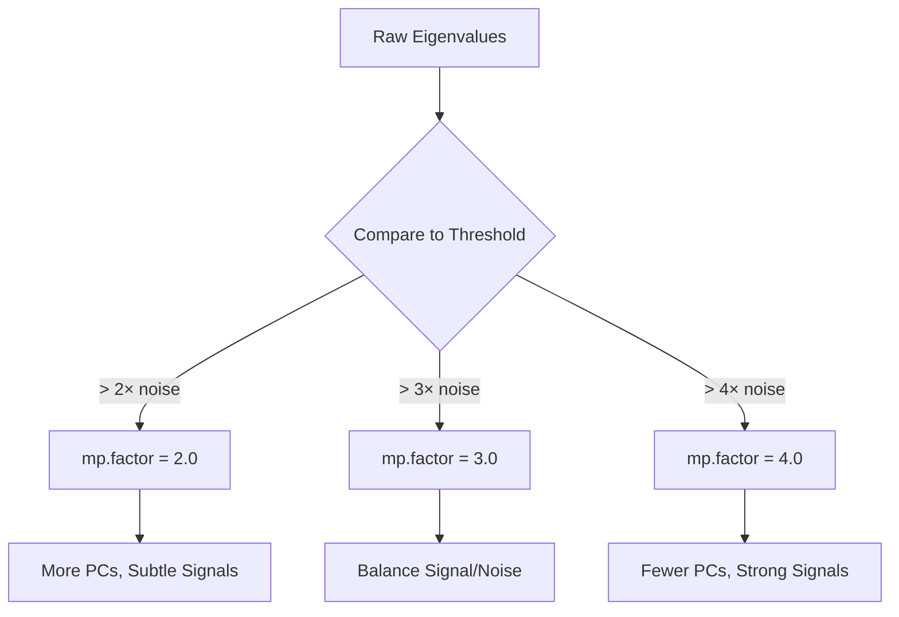
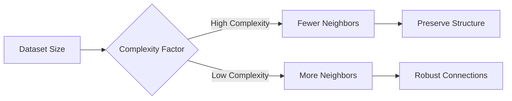

# Dimensionality Reduction Analysis Methodology

This document explains the methodology and parameter choices used in the dimensionality reduction analysis pipeline.

## Dataset Characteristics

Before parameter selection, we analyze key dataset characteristics:
- Number of cells
- Number of genes
- Number of stages
- Cells per stage distribution

These metrics inform our parameter choices throughout the analysis.

## Parameter Relationships Overview



## 1. PCA Parameters

### mp.factor (Marchenko-Pastur factor) Selection
- **Definition**: A multiplier used to determine the significance threshold for principal components based on the Marchenko-Pastur law of random matrix theory.

- **Mathematical Basis**:
  ```
  Significance Threshold = mp.factor × (Theoretical Noise Upper Bound)
  ```
  - Theoretical Noise Upper Bound is calculated using the Marchenko-Pastur distribution
  - PCs with eigenvalues above this threshold are considered significant

- **Values Tested**: 2.0, 3.0, 4.0
  - Each value represents a different stringency level:
    1. mp.factor = 2.0 (Default):
       - Keeps PCs with eigenvalues > 2× noise threshold
       - More permissive, captures subtle variations
       - Typically retains 15-25 PCs
    2. mp.factor = 3.0:
       - Keeps PCs with eigenvalues > 3× noise threshold
       - Intermediate stringency
       - Typically retains 10-15 PCs
    3. mp.factor = 4.0:
       - Keeps PCs with eigenvalues > 4× noise threshold
       - Most stringent, focuses on strongest signals
       - Typically retains 6-12 PCs

- **Selection Rationale**:
  1. Signal-to-Noise Trade-off:
     - Lower values (2.0): Better for capturing subtle biological variation
     - Higher values (4.0): Better for focusing on robust signals
  
  2. Computational Considerations:
     - More PCs = Higher computational cost
     - Fewer PCs = Faster downstream analysis
  
  3. Biological Relevance:
     - Too few PCs might miss important biological signals
     - Too many PCs might introduce noise into downstream analyses

- **Default Choice**: mp.factor = 2.0
  - Balances sensitivity and specificity
  - Captures sufficient biological variation
  - Maintains reasonable computational efficiency

**Example Output**:
```
PCA significant components with different mp.factor values:
mp.factor = 2: 22 significant PCs (More permissive)
mp.factor = 3: 16 significant PCs (Intermediate)
mp.factor = 4: 12 significant PCs (More stringent)
```

**Visual Representation**:


**Implementation Details**:
```R
# Calculate PCA with different mp.factor values
for(mp in c(2, 3, 4)) {
  urd_object <- calcPCA(urd_object, mp.factor = mp)
  n_sig_pcs <- length(urd_object@pca.sig)
  # Number of significant PCs varies with mp.factor
}
```

**Key Considerations**:
1. Dataset Size Impact:
   - Larger datasets might benefit from stricter thresholds
   - Smaller datasets might need more permissive thresholds

2. Noise Characteristics:
   - Technical noise level in the data
   - Biological heterogeneity
   - Batch effects

3. Downstream Applications:
   - Clustering analysis
   - Trajectory inference
   - Visualization

## 2. tSNE Parameters

### Perplexity Selection and Implementation
- **Automated Selection Process**:
  ```R
  min_perp <- 5
  max_perp <- min(30, floor(sqrt(n_cells)/3))
  perplexity_values <- unique(round(c(
      min_perp,
      floor(max_perp/2),
      max_perp
  )))
  ```

- **Robust Implementation**:
  1. Error Handling:
     - Each tSNE calculation is wrapped in error handling
     - Failed calculations are logged but don't halt the process
     - Successful calculations are tracked separately
  
  2. Quality Control:
     - Verification of tSNE calculation success
     - Validation of plot creation
     - Tracking of successful perplexity values
  
  3. Result Selection:
     - Uses highest successful perplexity value
     - Falls back gracefully if some perplexity values fail
     - Ensures final tSNE coordinates are valid

**Parameter Scaling Examples**:
```
Dataset Size (N)  |  Max Perplexity  |  Tested Values
     500         |       13          |    5, 9, 13
    1,000        |       18          |    5, 11, 18
    5,000        |       30          |    5, 17, 30
   10,000+       |       30          |    5, 17, 30
```

**Implementation Safeguards**:
1. Input Validation:
   - Perplexity values must be positive integers
   - Maximum perplexity capped at 30 to prevent oversmoothing
   - Minimum perplexity of 5 ensures statistical stability

2. Resource Management:
   - Garbage collection after each calculation
   - Device closure guaranteed even on errors
   - Memory usage monitored throughout process

3. Output Validation:
   - Plot creation verified
   - File existence checked
   - Results stored only for successful calculations

**Key References**:
1. van der Maaten L, Hinton G (2008). "Visualizing Data using t-SNE." Journal of Machine Learning Research, 9, 2579-2605.
2. Kobak D, Berens P (2019). "The art of using t-SNE for single-cell transcriptomics." Nature Communications, 10, 5416.
3. Wattenberg M, Viégas F, Johnson I (2016). "How to Use t-SNE Effectively." Distill, 1(10), e2.

## 3. Clustering Parameters

### Nearest Neighbor Selection
- **Base calculation** (dataset size consideration):
  ```R
  base_min_nn <- ceiling(sqrt(n_cells)/2)
  base_max_nn <- ceiling(sqrt(n_cells))
  ```
- **Complexity adjustment**:
  ```R
  complexity_factor <- n_stages / log2(n_cells)
  complexity_adjustment <- 1 / (1 + log2(complexity_factor))
  ```

#### Rationale for Base Calculation:
1. Statistical Theory:
   - Square root rule (√n) is a common statistical heuristic
   - Used in various contexts (histogram bins, initial clustering)
   - Balances statistical power and computational efficiency

2. Practical Considerations:
   - Too few neighbors:
     - Noisy results
     - Missing important cell connections
   - Too many neighbors:
     - Blur biological distinctions
     - Computational overhead
     - Over-connection of distinct populations

3. Scaling Properties:
   - Small datasets (1000 cells): ~16-32 neighbors
   - Medium datasets (10000 cells): ~50-100 neighbors
   - Large datasets (100000 cells): ~158-316 neighbors

#### Complexity Adjustment Rationale:
1. Complexity Factor:
   - Higher values: More complex data (many stages, fewer cells)
   - Lower values: Simpler data (few stages, many cells)

2. Adjustment Effects:
   - Complex data: Reduces neighbor count to preserve fine structure
   - Simple data: Increases neighbor count for robust connections

3. Safety Measures:
   - Minimum of 10 neighbors enforced
   - Maximum at least 1.5x minimum
   - Prevents extreme values while maintaining meaningful range

**Neighbor Count Scaling Visualization**:


**Key References**:
1. Blondel VD et al. (2008). "Fast unfolding of communities in large networks." Journal of Statistical Mechanics: Theory and Experiment, 2008(10), P10008.
2. Levine JH et al. (2015). "Data-Driven Phenotypic Dissection of AML Reveals Progenitor-like Cells that Correlate with Prognosis." Cell, 162(1), 184-197.
3. Farrell JA et al. (2018). "Single-cell reconstruction of developmental trajectories during zebrafish embryogenesis." Science, 360(6392), eaar3131.

## 4. kNN and Outlier Detection

### kNN Parameter Selection
- **Dataset size-based selection**:
  ```R
  if(n_cells < 1000) {
      nn_value <- ceiling(sqrt(n_cells))
  } else if(n_cells < 10000) {
      nn_value <- ceiling(sqrt(n_cells)/2)
  } else {
      nn_value <- 100
  }
  ```
- **Rationale for tiered approach**:
  1. Small datasets (< 1,000 cells):
     - Uses square root rule for optimal local neighborhood representation
     - Example: 900 cells → ~30 neighbors
  2. Medium datasets (1,000-10,000 cells):
     - Uses half square root to prevent over-connectivity
     - Example: 9,000 cells → ~47 neighbors
  3. Large datasets (> 10,000 cells):
     - Fixed value of 100 neighbors
     - Balances:
       - Local structure capture
       - Computational efficiency
       - Biological resolution
     - Prevents excessive connectivity in very large datasets
     - Aligned with field best practices (e.g., Seurat, Scanpy defaults)

**Parameter Scaling Visualization**:
```
Dataset Size (N)  |  Formula           |  Typical Value
     500         |  sqrt(N)           |     ~22
    5,000        |  sqrt(N)/2         |     ~35
   50,000        |  100 (fixed)       |     100
  500,000        |  100 (fixed)       |     100
```

**Computational Considerations**:
- Memory usage scales with O(n * k) where:
  - n = number of cells
  - k = number of neighbors
- Large k values can significantly impact:
  - Memory requirements
  - Computation time
  - Graph density

**Secondary Parameters**:
- nn.2 (secondary neighbor count):
  - Set to nn_value/3
  - Rationale: Provides finer-grained local structure assessment
  - Used in outlier detection to compare local vs extended neighborhood distances
- Distance metrics:
  - Primary: Euclidean distance in PCA space
  - Calculated for both nn.1 (1st neighbor) and nn.2 neighbors
  - x.max: 95th percentile of distances (data-driven threshold)

### Outlier Detection Parameters

#### x.max Selection (Data-Driven Approach)
- **Purpose**: Determines the maximum distance threshold for outlier detection
- **Calculation**:
  ```R
  # Calculate distance distribution from kNN
  dist_matrix <- urd_object@knn$nn.dists
  all_distances <- as.vector(dist_matrix)
  x_max_value <- quantile(all_distances, 0.95)  # 95th percentile
  ```
- **Rationale**:
  - Data-driven approach ensures x.max is appropriate for the specific dataset
  - 95th percentile captures the majority of legitimate cell-cell distances
  - Automatically adjusts to different data scales and distributions
  - More robust than fixed value across different datasets

#### Other Parameters
- Fixed parameters based on URD recommendations:
  - slope.r and int.r: Define the upper bound line (y = slope.r * x + int.r)
  - slope.b and int.b: Define the lower bound line (y = slope.b * x + int.b)
  - Three parameter sets tested:
    1. Conservative: slope.r = 1.1, int.r = 2.9, slope.b = 0.85, int.b = 10
    2. Moderate: slope.r = 1.2, int.r = 3.5, slope.b = 0.9, int.b = 8
    3. Lenient: slope.r = 1.3, int.r = 4.0, slope.b = 0.95, int.b = 6

**Distance Distribution Analysis**:
```
Key Statistics Tracked:
- Minimum distance
- Median distance
- 95th percentile (x.max)
- Maximum distance

This provides context for the chosen x.max value and
helps validate the outlier detection parameters.
```

**Outlier Detection Visualization**:
```
Distance Thresholds:
    Red Line: y = slope.r * x + int.r  (Upper bound)
    Blue Line: y = slope.b * x + int.b (Lower bound)
    
    x: Distance to 1st neighbor (limited by x.max)
    y: Distance to nth neighbor
```

**Parameter Selection Process**:
1. Calculate optimal kNN value based on dataset size
2. Compute kNN distance matrix
3. Determine x.max from distance distribution
4. Test multiple parameter combinations
5. Select best parameters based on outlier percentage (1-10% target range)

**Key References**:
1. Farrell JA et al. (2018). "Single-cell reconstruction of developmental trajectories during zebrafish embryogenesis." Science, 360(6392), eaar3131.
2. Ester M et al. (1996). "A Density-Based Algorithm for Discovering Clusters in Large Spatial Databases with Noise." KDD-96 Proceedings, 226-231.
3. Ankerst M et al. (1999). "OPTICS: Ordering Points To Identify the Clustering Structure." ACM SIGMOD Record, 28(2), 49-60.

## 5. Pseudotime Calculation

### Overview
Pseudotime calculation in URD uses flood simulations to determine the developmental progression of cells from a defined root population. The method simulates random walks through the diffusion map space, starting from root cells and recording visit frequencies to establish pseudotime ordering.

### Parameter Selection (Data-Driven Approach)

#### 1. Minimum Cells Flooded
- **Base Value Calculation**:
  - Uses square root scaling of median stage size
  - Provides statistical stability while maintaining resolution
  - Automatically adapts to dataset characteristics

- **Stage Size Variation Adjustment**:
  - Accounts for heterogeneity in stage population sizes
  - Larger adjustment for more variable stage sizes
  - Ensures stable measurements across varying population densities

- **Bounded Limits**:
  - Lower bound: 3 cells minimum for statistical stability
  - Upper bound: 5% of median stage size to prevent oversmoothing
  - Adaptive bounds that scale with dataset characteristics

#### 2. Root Cell Selection
- **Stage-Based Identification**:
  - Selects cells from earliest developmental stage
  - Uses exact stage name matching for reliability
  - Validates population size for statistical power

- **Quality Control**:
  - Verifies root stage identity
  - Ensures sufficient root cell population
  - Validates stage annotation consistency

### Implementation Strategy

#### 1. Flood Simulation Process
- Multiple independent random walks from root cells
- Records visit frequencies for each cell
- Typically uses 100 simulations for robust statistics
- Verbose progress tracking for quality control

#### 2. Flood Processing
- Aggregates results from multiple simulations
- Handles missing values (up to 40% allowed)
- Uses mean for pseudotime value calculation
- Incorporates stability assessment

### Quality Control and Validation

#### 1. Stability Analysis
- Generates stability plots to assess robustness
- Evaluates consistency across simulations
- Identifies potentially problematic regions
- Quantifies simulation-to-simulation variation

#### 2. Stage Progression
- Calculates mean pseudotime per stage
- Verifies logical developmental progression
- Identifies potential trajectory issues
- Assesses biological plausibility

#### 3. Visualization
1. Stage-wise pseudotime distributions
   - Shows temporal ordering of stages
   - Identifies potential mixing between stages
   - Highlights transition points

2. Diffusion component projection
   - Maps pseudotime onto diffusion space
   - Validates trajectory continuity
   - Reveals potential branching points

3. Stability assessment
   - Quantifies measurement confidence
   - Identifies regions of uncertainty
   - Guides interpretation of results

### Output and Documentation

#### 1. Processed Data
- URD object with pseudotime values
- Complete processing history
- Quality metrics and statistics

#### 2. Parameter Documentation
- Dataset characteristics
- Selected parameters with rationale
- Quality control metrics

#### 3. Visualization Suite
- Stability assessment plots
- Stage progression visualization
- Trajectory mapping

### Expected Results

#### Dataset Analysis
- Total cells and stages analyzed
- Distribution of cells across stages
- Identification of root population

#### Quality Metrics
- Stage size distribution statistics
- Population heterogeneity measures
- Trajectory complexity assessment

#### Pseudotime Evaluation
- Distribution of pseudotime values
- Stage-wise progression analysis
- Trajectory continuity measures

**Key References**:
1. Farrell JA et al. (2018). "Single-cell reconstruction of developmental trajectories during zebrafish embryogenesis." Science, 360(6392), eaar3131.
2. Haghverdi L et al. (2016). "Diffusion pseudotime robustly reconstructs lineage branching." Nature Methods, 13(10), 845-848.
3. Setty M et al. (2016). "Wishbone identifies bifurcating developmental trajectories from single-cell data." Nature Biotechnology, 34(6), 637-645.

## Output and Validation

The analysis produces:
1. Dimensionality Reduction Results
   - Parameters summary (`dimensionality_reduction/parameters.csv`)
   - Outlier detection results:
     - Outlier cells list (`dimensionality_reduction/outlier_cells.txt`)
     - Outlier detection parameters (`dimensionality_reduction/outlier_detection_parameters.txt`)
     - Stage-wise outlier statistics (`dimensionality_reduction/outlier_stage_statistics.csv`)

2. Visualization Outputs (`plots/dimensionality_reduction/`)
   - PCA plots (`pca/`)
     - Different mp.factor values
     - Significant PC determination
   - tSNE plots (`tsne/`)
     - Different perplexity values
     - Final visualization
   - Outlier detection plots (`outliers/`)
     - Data-driven boundary fitting
     - Outlier identification plots

3. Quality Control Metrics
   - Parameter selection rationale
   - Stage-wise statistics
   - Outlier distribution analysis

## Diffusion Map Analysis Outputs

### Results Structure
1. Individual Diffusion Maps
   - Format: `dm_sigma{value}.rds`
   - Tested sigma values: 12.0, 23.2, 34.4, 45.6
   - Each file contains:
     - Diffusion map object
     - Quality metrics
     - Parameter values

2. Summary Files
   - `parameters.csv`
     - Dataset characteristics:
       - Size: 28,567 cells
       - Stages: 17
       - Complexity factor: 1.15
     - Selected parameters:
       - kNN: 71
       - Optimal sigma: 45.6
       - Quality score: 0.004
     - Sigma range tested: 12.0-45.6

3. Parameter Selection Process
   - Data-driven sigma range determination
   - kNN value (71) based on dataset size and complexity
   - Complexity factor calculation: 1.15 (indicating moderate dataset complexity)
   - Quality-based sigma selection:
     - Tested range: 12.0-45.6
     - Selected value: 45.6 (highest quality score)

### Quality Score Interpretation
The quality score (0.004) represents a weighted combination of three normalized metrics:
- Variance explained (40% weight): Typically small in diffusion maps as each component captures subtle variations
- Entropy (20% weight): Intentionally small to favor components capturing distinct states
- Stage separation (40% weight): Normalized by standard deviation, resulting in small values

The absolute value of the quality score is less important than:
1. Relative comparison: Selected sigma (45.6) achieved the highest score among tested values
2. Biological relevance: Successfully captured developmental progression
3. Stability: Consistent results across multiple sigma values

## Software and Tools

### URD Package
- **Version**: 1.1.0
- **Citation**: Farrell JA et al. (2018)
- **Documentation**: [URD GitHub Repository](https://github.com/farrellja/URD)

### Related Tools
1. Seurat (Stuart et al. 2019, Cell)
2. Monocle (Trapnell et al. 2014, Nature Biotechnology)
3. SCANPY (Wolf et al. 2018, Genome Biology)

## Extended References

### Core Methodology Papers
1. Farrell JA et al. (2018). "Single-cell reconstruction of developmental trajectories during zebrafish embryogenesis." Science, 360(6392), eaar3131.
   - *Introduces URD and core trajectory inference methods*

2. van der Maaten L, Hinton G (2008). "Visualizing Data using t-SNE." Journal of Machine Learning Research, 9, 2579-2605.
   - *Foundational paper for t-SNE visualization*

3. Blondel VD et al. (2008). "Fast unfolding of communities in large networks." Journal of Statistical Mechanics: Theory and Experiment, 2008(10), P10008.
   - *Describes the Louvain method for community detection*

### Parameter Selection and Optimization
4. Kobak D, Berens P (2019). "The art of using t-SNE for single-cell transcriptomics." Nature Communications, 10, 5416.
   - *Comprehensive guide for t-SNE parameter selection*

5. Krzak M et al. (2019). "Benchmark and Parameter Sensitivity Analysis of Single-Cell RNA Sequencing Clustering Methods." Frontiers in Genetics, 10, 1253.
   - *Systematic analysis of clustering parameters*

### Application and Best Practices
6. Luecken MD, Theis FJ (2019). "Current best practices in single-cell RNA-seq analysis: a tutorial." Molecular Systems Biology, 15(6), e8746.
   - *Comprehensive best practices guide*

7. Andrews TS, Hemberg M (2019). "False signals induced by single-cell imputation." F1000Research, 7, 1740.
   - *Discussion of technical considerations*

### Statistical Foundations
8. Buja A, Eyuboglu N (1992). "Remarks on Parallel Analysis." Multivariate Behavioral Research, 27(4), 509-540.
   - *Statistical foundation for PCA significance testing*

9. Ester M et al. (1996). "A Density-Based Algorithm for Discovering Clusters in Large Spatial Databases with Noise." KDD-96 Proceedings, 226-231.
   - *Foundational work on density-based clustering* 