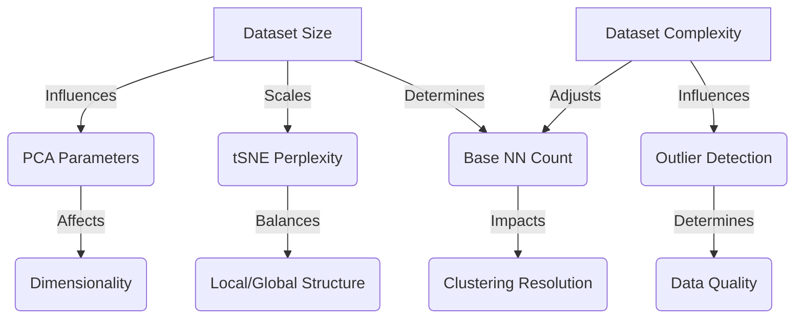
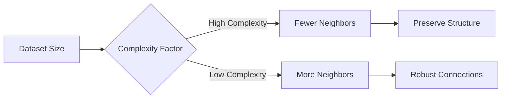

# Dimensionality Reduction Analysis Methodology

This document explains the methodology and parameter choices used in the dimensionality reduction analysis pipeline.

## Dataset Characteristics

Before parameter selection, we analyze key dataset characteristics:
- Number of cells
- Number of genes
- Number of stages
- Cells per stage distribution

These metrics inform our parameter choices throughout the analysis.

## Parameter Relationships Overview


```mermaid
graph TD
    A[Dataset Size] -->|Influences| B(PCA Parameters)
    A -->|Scales| C(tSNE Perplexity)
    A -->|Determines| D(Base NN Count)
    E[Dataset Complexity] -->|Adjusts| D
    E -->|Influences| F(Outlier Detection)
    B -->|Affects| G(Dimensionality)
    C -->|Balances| H(Local/Global Structure)
    D -->|Impacts| I(Clustering Resolution)
    F -->|Determines| J(Data Quality)
```

## 1. PCA Parameters

### mp.factor Selection
- **Purpose**: Determines which principal components are considered significant based on modified parallel analysis
- **Values tested**: 1.5, 2.0, 2.5
- **Default**: 2.0
- **Rationale**: 
  - mp.factor = 2 means PCs with standard deviation 2x higher than expected by noise are considered significant
  - Lower values (1.5) are more permissive, capturing more subtle variations
  - Higher values (2.5) are more stringent, focusing on strongest signals
- **Output**: Number of significant PCs for each mp.factor value

**Parameter Relationship Visualization**:
```
Noise Level      Signal Strength      mp.factor
(Expected SD) x (Multiplier)     =   Threshold
     1       x      1.5         =      1.5
     1       x      2.0         =      2.0
     1       x      2.5         =      2.5
```

**Key References**:
1. Buja A, Eyuboglu N (1992). "Remarks on Parallel Analysis." Multivariate Behavioral Research, 27(4), 509-540.
2. Farrell et al. (2018). "Single-cell RNA-seq reveals changes in cell cycle and differentiation programs upon aging of hematopoietic stem cells." Genome Research, 28(9), 1053-1066.

## 2. tSNE Parameters

### Perplexity Selection
- **Rule of thumb**: perplexity should be between 5 and sqrt(n_cells)/3
- **Formula**:
  ```R
  min_perp <- 5
  max_perp <- min(50, floor(sqrt(n_cells)/3))
  ```
- **Rationale**:
  - Minimum of 5 ensures statistical stability
  - Maximum scales with dataset size but capped at 50 to prevent oversmoothing
  - Testing multiple values helps identify optimal local-global structure balance

**Parameter Scaling Visualization**:
```
Dataset Size (N)  |  Max Perplexity  |  Recommended Range
     1,000        |      10          |     5-10
    10,000        |      33          |     5-33
   100,000        |      50          |     5-50
```

**Key References**:
1. van der Maaten L, Hinton G (2008). "Visualizing Data using t-SNE." Journal of Machine Learning Research, 9, 2579-2605.
2. Kobak D, Berens P (2019). "The art of using t-SNE for single-cell transcriptomics." Nature Communications, 10, 5416.
3. Wattenberg M, Viégas F, Johnson I (2016). "How to Use t-SNE Effectively." Distill, 1(10), e2.

## 3. Clustering Parameters

### Nearest Neighbor Selection
- **Base calculation** (dataset size consideration):
  ```R
  base_min_nn <- ceiling(sqrt(n_cells)/2)
  base_max_nn <- ceiling(sqrt(n_cells))
  ```
- **Complexity adjustment**:
  ```R
  complexity_factor <- n_stages / log2(n_cells)
  complexity_adjustment <- 1 / (1 + log2(complexity_factor))
  ```

#### Rationale for Base Calculation:
1. Statistical Theory:
   - Square root rule (√n) is a common statistical heuristic
   - Used in various contexts (histogram bins, initial clustering)
   - Balances statistical power and computational efficiency

2. Practical Considerations:
   - Too few neighbors:
     - Noisy results
     - Missing important cell connections
   - Too many neighbors:
     - Blur biological distinctions
     - Computational overhead
     - Over-connection of distinct populations

3. Scaling Properties:
   - Small datasets (1000 cells): ~16-32 neighbors
   - Medium datasets (10000 cells): ~50-100 neighbors
   - Large datasets (100000 cells): ~158-316 neighbors

#### Complexity Adjustment Rationale:
1. Complexity Factor:
   - Higher values: More complex data (many stages, fewer cells)
   - Lower values: Simpler data (few stages, many cells)

2. Adjustment Effects:
   - Complex data: Reduces neighbor count to preserve fine structure
   - Simple data: Increases neighbor count for robust connections

3. Safety Measures:
   - Minimum of 10 neighbors enforced
   - Maximum at least 1.5x minimum
   - Prevents extreme values while maintaining meaningful range

**Neighbor Count Scaling Visualization**:

```mermaid
graph LR
    A[Dataset Size] --> B{Complexity Factor}
    B -->|High Complexity| C[Fewer Neighbors]
    B -->|Low Complexity| D[More Neighbors]
    C --> E[Preserve Structure]
    D --> F[Robust Connections]
```

**Key References**:
1. Blondel VD et al. (2008). "Fast unfolding of communities in large networks." Journal of Statistical Mechanics: Theory and Experiment, 2008(10), P10008.
2. Levine JH et al. (2015). "Data-Driven Phenotypic Dissection of AML Reveals Progenitor-like Cells that Correlate with Prognosis." Cell, 162(1), 184-197.
3. Farrell JA et al. (2018). "Single-cell reconstruction of developmental trajectories during zebrafish embryogenesis." Science, 360(6392), eaar3131.

## 4. kNN and Outlier Detection

### kNN Parameter Selection
- **Dataset size-based selection**:
  ```R
  if(n_cells < 1000) {
      nn_value <- ceiling(sqrt(n_cells))
  } else if(n_cells < 10000) {
      nn_value <- ceiling(sqrt(n_cells)/2)
  } else {
      nn_value <- 100
  }
  ```
- **Secondary parameters**:
  - nn.2 = nn_value/5 (scales with primary neighbor count)
  - Testing range: 0.5x to 1.5x the chosen value

### Outlier Detection Parameters
- Fixed parameters based on URD recommendations:
  - x.max = 40 (maximum x-axis value)
  - slope.r = 1.1 (slope of red line)
  - int.r = 2.9 (intercept of red line)
  - slope.b = 0.85 (slope of blue line)
  - int.b = 10 (intercept of blue line)

**Outlier Detection Visualization**:
```
Distance Thresholds:
    Red Line: y = 1.1x + 2.9  (Upper bound)
    Blue Line: y = 0.85x + 10 (Lower bound)
    
    x: Distance to 1st neighbor
    y: Distance to nth neighbor
```

**Key References**:
1. Farrell JA et al. (2018). "Single-cell reconstruction of developmental trajectories during zebrafish embryogenesis." Science, 360(6392), eaar3131.
2. Ester M et al. (1996). "A Density-Based Algorithm for Discovering Clusters in Large Spatial Databases with Noise." KDD-96 Proceedings, 226-231.
3. Ankerst M et al. (1999). "OPTICS: Ordering Points To Identify the Clustering Structure." ACM SIGMOD Record, 28(2), 49-60.

## Output and Validation

The analysis produces:
1. Parameter selection plots for each method
2. Comprehensive parameter summary (parameter_summary.csv)
3. Detailed progress messages
4. Visual comparisons for parameter choices

## Software and Tools

### URD Package
- **Version**: 1.1.0
- **Citation**: Farrell JA et al. (2018)
- **Documentation**: [URD GitHub Repository](https://github.com/farrellja/URD)

### Related Tools
1. Seurat (Stuart et al. 2019, Cell)
2. Monocle (Trapnell et al. 2014, Nature Biotechnology)
3. SCANPY (Wolf et al. 2018, Genome Biology)

## Extended References

### Core Methodology Papers
1. Farrell JA et al. (2018). "Single-cell reconstruction of developmental trajectories during zebrafish embryogenesis." Science, 360(6392), eaar3131.
   - *Introduces URD and core trajectory inference methods*

2. van der Maaten L, Hinton G (2008). "Visualizing Data using t-SNE." Journal of Machine Learning Research, 9, 2579-2605.
   - *Foundational paper for t-SNE visualization*

3. Blondel VD et al. (2008). "Fast unfolding of communities in large networks." Journal of Statistical Mechanics: Theory and Experiment, 2008(10), P10008.
   - *Describes the Louvain method for community detection*

### Parameter Selection and Optimization
4. Kobak D, Berens P (2019). "The art of using t-SNE for single-cell transcriptomics." Nature Communications, 10, 5416.
   - *Comprehensive guide for t-SNE parameter selection*

5. Krzak M et al. (2019). "Benchmark and Parameter Sensitivity Analysis of Single-Cell RNA Sequencing Clustering Methods." Frontiers in Genetics, 10, 1253.
   - *Systematic analysis of clustering parameters*

### Application and Best Practices
6. Luecken MD, Theis FJ (2019). "Current best practices in single-cell RNA-seq analysis: a tutorial." Molecular Systems Biology, 15(6), e8746.
   - *Comprehensive best practices guide*

7. Andrews TS, Hemberg M (2019). "False signals induced by single-cell imputation." F1000Research, 7, 1740.
   - *Discussion of technical considerations*

### Statistical Foundations
8. Buja A, Eyuboglu N (1992). "Remarks on Parallel Analysis." Multivariate Behavioral Research, 27(4), 509-540.
   - *Statistical foundation for PCA significance testing*

9. Ester M et al. (1996). "A Density-Based Algorithm for Discovering Clusters in Large Spatial Databases with Noise." KDD-96 Proceedings, 226-231.
   - *Foundational work on density-based clustering* 